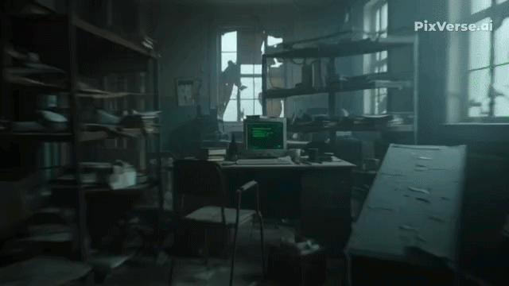

<p align="center">
  
</p>

<h1 align="center">👋 Olá, eu sou o Davi (BAYFOX)</h1>

<p align="center">
  
</p>

---

## 🖥️ Meu Terminal

```json id="terminal-final"
{
  "name": "Davi (BAYFOX)",
  "role": "RF, Telecom, AI & Database Specialist",
  "experience": "20+ years",
  "focus": [
    "Radio Communication",
    "Intercom Systems",
    "RF Coverage",
    "LTE 4G",
    "Artificial Intelligence",
    "Mobile Development",
    "Database Systems"
  ],
  "tools": [
    "Android Studio",
    "VS Code",
    "Firebase"
  ],
  "stack": [
    "React",
    "Python"
  ],
  "databases": [
    "SQLite",
    "PostgreSQL",
    "Firebase Realtime DB"
  ],
  "equipment": [
    "Hollyland T1000",
    "Solidcom M1",
    "C1 Pro",
    "C1 Pro Roaming"
  ],
  "learning": [
    "AI",
    "Networking",
    "Cybersecurity"
  ]
}
```

---

## 🚀 Tech Stack

### 📡 Telecom & RF

<p align="center">
  
  
  
  
</p>

---

### 🤖 Inteligência Artificial

<p align="center">
  
</p>

---

### 📱 Mobile & Frontend

<p align="center">
  
</p>

---

### 🗄️ Banco de Dados

<p align="center">
  
</p>

---

### 💻 Ferramentas

<p align="center">
  
</p>

---

### 🧠 Infra & Redes

<p align="center">
  
</p>

---

## 📊 Projetos

* 📡 Planejamento de cobertura RF para eventos
* 🎧 Sistemas de intercom profissional
* 🔧 Programação de rádios HT e DMR
* 🏢 Estruturação de redes corporativas
* 🤖 Projetos com IA aplicada
* 📱 Aplicações Android
* 🗄️ Integração com banco de dados (Firebase / SQL)

---

## 📚 Estudando

<p align="center">
  
</p>

* Inteligência Artificial
* Engenharia da Computação
* Segurança de redes
* Arquitetura de bancos de dados

---

## 🌐 Contato

<p align="center">
  <a href="#"></a>
  <a href="#"></a>
  <a href="#"></a>
</p>

---

## ⚡ Frase

> Programe. Se não for, reprograme
